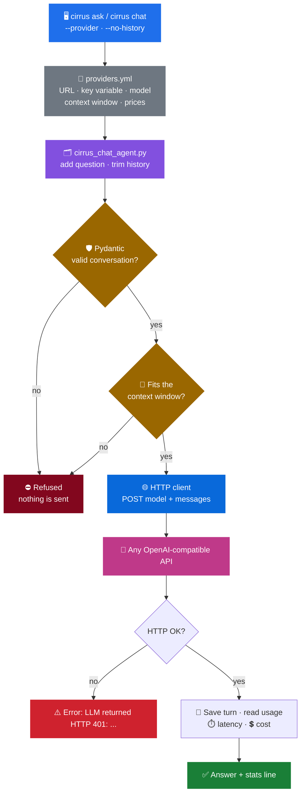
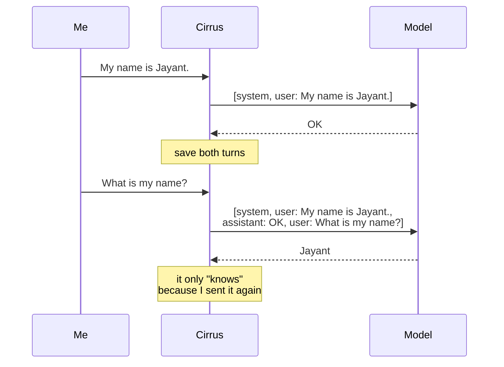
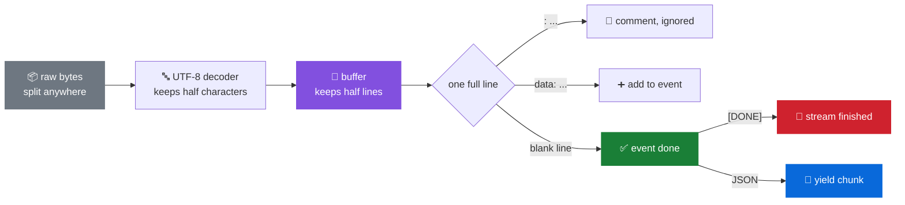

<div align="center">

# ☁️ Cirrus: A Model Client from Scratch

**Talk to any OpenAI-compatible model with raw HTTP, and know exactly what each call costs.**
No OpenAI SDK. No Google or Groq SDK. No LangChain. Just `POST` requests and JSON.


</div>

---

Most people talk to LLMs through an SDK, and the SDK hides what really happens.

Underneath, a call to a model is **one HTTP request with a list of messages in it**. Chat memory isn't memory, just the client sending the old messages again. Cost isn't a mystery, just three token counts times three prices. I wanted to see all of that with my own eyes, so I'm building **Cirrus**, an assistant that will one day help run an AWS account, starting from the very bottom.

This repo is stage **1: Talk to models**:

- **1.1: A model client from scratch**: raw HTTP, chat history, token counting and exact cost
- **1.2: Streaming, parsed by hand**: answers printed as they're generated, through a Server-Sent Events parser I wrote myself

> **A note on authorship:** I wrote the code myself, because writing it is how I learn the concepts. The tests and this README were written by AI. I spent the tokens on thinking, AI spent them on typing. Fair trade, and like every call in this repo, it came to exactly $0.000000.

---

## ✅ Challenge 1.1

| What to build | |
|---|---|
| `cirrus ask "question"` and `cirrus chat` (keeps the history) | ✅ |
| Providers in one config file: base URL, API key variable, model, context window, prices | ✅ `providers.yml` |
| Raw HTTP with `httpx` / `requests`, no provider SDKs | ✅ |
| After each answer, print input tokens, output tokens, latency and cost | ✅ |
| Estimate tokens before sending, refuse a request that won't fit, with a clear message | ✅ |
| Provider errors as HTTP status + provider message, never a stack trace | ✅ |

| Prove it | |
|---|---|
| Cost function returns exactly **$0.00126** for the test data | ✅ `test/utils/test_cost.py` |
| In `cirrus chat` a follow-up works; with history off, the model doesn't know what you asked | ✅ shown below |
| An input of 500,000 words is refused before any request is sent | ✅ shown below |
| The same question works on two providers by changing only the config | 🔜 waiting for a second API key (NVIDIA works; Groq, Gemini, OpenRouter and Ollama are already in `providers.yml`) |

## ✅ Challenge 1.2

| What to build | |
|---|---|
| Stream answers in `cirrus ask` and `cirrus chat`, printing text as it arrives | ✅ on by default, `--no-stream` to wait |
| My own SSE parser: raw byte chunks split anywhere, ignores `:` comments, stops at `data: [DONE]` | ✅ `app/utils/sse_parser.py` |
| Read the final usage if the provider sends it, otherwise estimate it and mark it | ✅ |
| Print time to first token and tokens per second | ✅ |
| FastAPI `POST /chat` that re-streams as SSE | ⏭️ skipped for now, Cirrus is a CLI chatbot |

| Prove it | |
|---|---|
| The test chunks give exactly `Hello` and report that the stream finished | ✅ `test/utils/test_sse_parser.py` |
| Feeding the same bytes one at a time gives the same result | ✅ `test/utils/test_sse_parser.py` |
| `curl -N` shows events arriving one by one from the endpoint | ⏭️ needs the FastAPI endpoint |
| Closing curl mid-answer cancels the upstream request | ⏭️ needs the FastAPI endpoint (in the CLI, Ctrl+C closes the connection, which cancels the request) |

---

## 🏗️ Architecture



Two things to notice:

- **Both checks run before the network.** A broken conversation or one that's too big costs nothing, because it never leaves my machine.
- **💾 Save happens after the answer.** If a call fails, the history is left as it was. Otherwise the failed question would stay in the history, and a retry would send it twice.

---

## 🧠 The Model Remembers Nothing

This was the biggest idea for me. Every call is independent: the model has never seen you before. To have a conversation, the client sends **the whole conversation, every time**.



You can see it in the token counts. Here's one of my own chats against NVIDIA's API:

```text
$ uv run cirrus chat
Chatting with nvidia (nvidia/nemotron-3-super-120b-a12b), history on. Ctrl+C to quit.
$ Hello
> Hello! How can I assist you today? 😊
  in 22 tok | out 96 tok | 1.30s | $0.000000 | nvidia/nemotron-3-super-120b-a12b via nvidia
$ WHat is your name
> I'm **Nemotron 3 Super**, a large language model created by NVIDIA. How can I assist you today? 😊
  in 52 tok | out 275 tok | 3.06s | $0.000000 | nvidia/nemotron-3-super-120b-a12b via nvidia
$ My name is Jayant
> Nice to meet you, Jayant! 😊 How can I assist you today? Whether you have a question, need help with something, or just want to chat—I'm here for you.
  in 99 tok | out 352 tok | 3.11s | $0.000000 | nvidia/nemotron-3-super-120b-a12b via nvidia
$ What is my name
> You told me your name is **Jayant** earlier in our conversation! 😊 Is there something specific you'd like to discuss or ask about today? I'm here to help.
  in 156 tok | out 296 tok | 3.09s | $0.000000 | nvidia/nemotron-3-super-120b-a12b via nvidia
```

Every question is just a few words, but the input keeps growing: **22 → 52 → 99 → 156 tokens**. That growth is the earlier turns being sent again with each new question. It's also why long chats get slower and more expensive the longer they go.

Now a similar test with history off:

```text
$ uv run cirrus chat --no-history
Chatting with nvidia (nvidia/nemotron-3-super-120b-a12b), history off. Ctrl+C to quit.
$ My name is Jayant. Reply with just OK.
> OK
  in 32 tok | out 32 tok | 0.68s | $0.000000 | nvidia/nemotron-3-super-120b-a12b via nvidia
$ What is my name? Reply in one short sentence.
> I don't know your name.
  in 32 tok | out 79 tok | 0.74s | $0.000000 | nvidia/nemotron-3-super-120b-a12b via nvidia
```

Same 32 tokens both times, and the model has no idea. **The history is the memory, and the client keeps it, not the model.**

(The free NVIDIA tier costs $0, so the cost column is zero. Output tokens look high for such short replies, like 296 tokens for two sentences, because this model "thinks" before answering, and those hidden reasoning tokens count as output too.)

---

## 🚀 Quick Demo

One question, no history:

```text
$ uv run cirrus ask "Reply with one word: capital of Japan?"
Tokyo
  in 30 tok | out 24 tok | 0.66s | $0.000000 | nvidia/nemotron-3-super-120b-a12b via nvidia
```

The answer goes to `stdout` and the stats line to `stderr`, so `cirrus ask "..." > answer.txt` saves only the answer.

A 500,000-word input is refused in about a second, **before** any request is sent:

```text
$ python -c "print('word ' * 500000)" | uv run cirrus ask -
Error: Request is about 500,017 tokens, but nvidia/nemotron-3-super-120b-a12b has room for only 126,976 input tokens (context window 131,072, 4,096 kept for the answer). Nothing was sent. Shorten the message and try again.
```

A provider error shows the HTTP status and the provider's own message, never a stack trace. Here it is with a wrong API key:

```text
$ uv run cirrus ask hi
Error: LLM returned HTTP 401: {"status":401,"title":"Unauthorized","detail":"Invalid JWT serialization: Missing dot delimiter(s)"}
```

And config mistakes say exactly what to fix:

```text
$ uv run cirrus ask hi --provider groq
Error: Provider 'groq' needs an API key. Set GROQ_API_KEY in .env

$ uv run cirrus ask hi --provider nope
Error: Unknown provider 'nope'. Choose one of: nvidia, openrouter, groq, gemini, ollama
```

---

## 🌊 Streaming, Parsed by Hand

A model writes one token at a time. Waiting for the whole answer means staring at nothing until the last token is done. Streaming prints each piece the moment it's generated:

```text
$ uv run cirrus ask "Name three AWS storage services, one line each."
Amazon S3
Amazon EBS
Amazon Glacier
  in 31 tok | out 73 tok | 1.36s | TTFT 1.32s | 241.4 tok/s | $0.000000 | nvidia/nemotron-3-super-120b-a12b via nvidia
```

Two new numbers describe how fast a model *feels*:

- **TTFT (time to first token):** how long until the first word of the answer shows up.
- **Tokens per second:** how fast the rest of it arrives.

Here TTFT is nearly the whole 1.36s, and the text then arrives at 241 tok/s. That's because Nemotron *thinks* before it answers: it streams its reasoning first (as `reasoning_content`, which Cirrus doesn't print), then the visible answer comes very fast.

### What the provider actually sends

Streams use **Server-Sent Events** (SSE). It's plain text: lines that start with `data:`, and a blank line ends each event. Here's the real stream from NVIDIA, trimmed:

```text
data: {"choices":[{"delta":{"reasoning_content":"The"}}], ..., "usage":null}

data: {"choices":[{"delta":{"content":"Amazon S3"}}], ..., "usage":null}

data: {"choices":[], ..., "usage":{"prompt_tokens":22,"completion_tokens":111, ...}}

data: [DONE]
```

Each event carries a small JSON chunk with a `delta`, the new piece of text. The last chunk has empty `choices` and the token `usage`, and `data: [DONE]` ends the stream.

### Why I needed my own parser

The network doesn't care about events. When I recorded one real response, **43 network chunks carried about 14 KB of events**, and the chunk edges fell wherever they liked: in the middle of a line, in the middle of a JSON string, even in the middle of `data:`.

So reading "one chunk = one event" breaks. The parser has to **keep the unfinished part and wait for more**. This is the test data from the challenge:

```python
chunks = [
    b': ping\n\n',                                             # comment, ignore it
    b'data: {"choices":[{"delta":{"content":"Hel"}}]}\n',      # event not finished yet
    b'\ndata: {"choices":[{"delta":{"content":"lo"}}]}\n\nda', # ends "Hel", then "lo", then half a word
    b'ta: [DONE]\n\n',                                         # the other half: stream is done
]
```

`SSEParser` turns that into exactly `Hello` and reports the stream as finished. Feeding the same bytes **one at a time** gives the same result, which is the real test that no chunk boundary can break it.



<details>
<summary><b>The edge cases that make it a real parser</b>: <code>app/utils/sse_parser.py</code></summary>

<br/>

| Case | What the parser does |
|---|---|
| A line split between chunks | keeps it in the buffer until the line ends |
| `\r\n`, `\n` or `\r` line endings | all three end a line |
| `\r` at the very end of a chunk | waits, because the `\n` of a `\r\n` may be in the next chunk |
| An emoji split between chunks | an incremental UTF-8 decoder keeps the half character |
| `: ping` comment lines | ignored (providers send them to keep the connection alive) |
| Several `data:` lines in one event | joined with `\n` |
| `data:value` with no space | works, and only one leading space is ever removed |
| `event:`, `id:`, `retry:` | `event` is kept, the others are ignored |
| Anything after `data: [DONE]` | ignored |
| Stream ends without the last blank line | the last event is still delivered |

No SSE library: it's plain Python, under 200 lines including docstrings, with 18 tests of its own.

</details>

<details>
<summary><b>Usage, TTFT and speed</b>: <code>cirrus_chat_agent.py</code></summary>

<br/>

- **Usage:** Cirrus asks for it with `"stream_options": {"include_usage": true}`, the OpenAI way, and reads it from the last chunk. If a provider doesn't send it, the tokens are counted locally and the line says `tokens estimated`.
- **TTFT:** measured from sending the request to the first piece of *visible* answer text.
- **Tokens per second:** tokens of answer text after the first one, divided by the time since the first one.
- **History:** a turn is saved only when the stream finishes. If it fails halfway, or you press Ctrl+C, the half answer is never saved, and closing the connection cancels the request at the provider.
- **Errors inside the stream:** a provider can send `data: {"error": ...}` in the middle of a 200 response. That's raised as an error, not printed as an answer.

</details>

---

## 💲 What a Call Costs

The challenge's test data:

> 1,000 input tokens, of which 600 were cached · 200 output tokens
> Prices per million: input $1.00 · cached input $0.10 · output $4.00

The trick is that **cached tokens are part of the input count**. They aren't extra; they're the cheap part of the input:

| Part | Tokens | Price / 1M | Cost |
|---|---:|---:|---:|
| Uncached input | 1,000 − 600 = **400** | $1.00 | $0.000400 |
| Cached input | **600** | $0.10 | $0.000060 |
| Output | **200** | $4.00 | $0.000800 |
| **Total** | | | **$0.001260** |

```python
uncached_input_tokens = usage.input_tokens - usage.cached_input_tokens

total = (
    uncached_input_tokens * prices.input
    + usage.cached_input_tokens * cached_price
    + usage.output_tokens * prices.output
)
return total / Decimal(1_000_000)
```

All money is `Decimal`, never `float`. With floats, `0.1` is really `0.1000000000000000055...`, and "exactly $0.00126" becomes "about $0.00126". Prices read from YAML go through `str` first, so `0.10` in the file is exactly `0.10` in the code.

---

## 🔬 Inside the Code

<details>
<summary><b>1. What a model call really is</b>: <code>llm_client_handlers.py</code></summary>

<br/>

Without an SDK, a chat call is just this:

```python
requests.post(
    url=self.base_url,
    json={"model": self.model, "messages": messages},
    headers={"Authorization": f"Bearer {api_key}"},
)
```

The answer is in `choices[0].message.content`, and the token counts are in `usage`.

That's the whole protocol. Because Gemini, Groq, OpenRouter, NVIDIA and Ollama all accept this same request, one careful client talks to all of them. Switching provider changes only the URL, the key and the model name, which is exactly what `providers.yml` holds.

</details>

<details>
<summary><b>2. One file for every provider</b>: <code>providers.yml</code></summary>

<br/>

```yaml
default: nvidia

providers:
  nvidia:
    base_url: https://integrate.api.nvidia.com/v1/chat/completions
    api_key_env: LLM_API_KEY
    model: nvidia/nemotron-3-super-120b-a12b
    context_window: 131072
    reserved_output_tokens: 4096
    prices: { input: 0, cached_input: 0, output: 0 }

  groq:
    base_url: https://api.groq.com/openai/v1/chat/completions
    api_key_env: GROQ_API_KEY
    ...
```

The file holds the **name** of the key variable, never the key itself. Keys stay in `.env`, which is git-ignored.

The file is validated with Pydantic when it loads: prices can't be negative, the context window must be positive, `reserved_output_tokens` must leave room for input, and `default` must name a real provider. A typo fails at startup with a clear message, not halfway through a request.

`cached_input` is optional. If a provider has no cache discount, cached tokens are simply charged at the input price.

</details>

<details>
<summary><b>3. Refusing what won't fit</b>: the context window check</summary>

<br/>

Before **any** of `invoke`, `ainvoke`, `stream` or `astream` sends anything, the client estimates the input with `tiktoken`:

```python
estimated_tokens = count_message_tokens(messages)
max_input_tokens = self.context_window - self.reserved_output_tokens
if estimated_tokens > max_input_tokens:
    raise ContextWindowExceededError(...)  # nothing was sent
```

Two things I had to think about:

- **The answer needs room too.** The context window covers input *and* output. If the input fills all 131,072 tokens, the model has no space left to reply. So each provider reserves some tokens for the answer.
- **It's an estimate.** `tiktoken` is OpenAI's tokenizer, and Llama, Gemini and Nemotron each tokenize a little differently. It's close enough to catch a 500,000-word input, and the provider still has the final say.

</details>

<details>
<summary><b>4. Trimming vs refusing</b>: <code>cirrus_chat_agent.py</code></summary>

<br/>

A long chat and one huge message are different problems:

- **A long chat** is fine, it just can't send *all* of it. Before each call, the history is trimmed from the oldest end until it fits:

  ```python
  for msg in reversed(chat_input_with_history):   # newest first
      msg_tokens = count_single_message_tokens(msg)
      if trimmed and total_tokens + msg_tokens > max_tokens:
          break                                    # older messages are dropped
      ...
  ```

- **One huge message** can't be trimmed, because it's the question itself. So the newest message is **always** kept, and the client's check refuses it with a clear message.

Early on, trimming dropped *everything* when one message was too long. The next request then had no user message at all and failed with a confusing error. Always keeping the newest message fixed that, and it's what makes the refusal message possible.

</details>

<details>
<summary><b>5. Usage: reported or estimated</b></summary>

<br/>

Most providers send real token counts back:

```json
"usage": {
  "prompt_tokens": 1000,
  "completion_tokens": 200,
  "prompt_tokens_details": { "cached_tokens": 600 }
}
```

Cirrus uses those numbers for the cost. If a provider sends no `usage`, Cirrus counts the tokens itself and marks the line, so an estimate never looks like a fact. For example:

```text
  in ~41 tok | out ~12 tok | 0.92s | $0.000000 | llama3.2 via ollama | tokens estimated
```

Latency is measured with `time.perf_counter()` around the HTTP call only, so it shows how fast the provider is, not how fast my code is.

</details>

<details>
<summary><b>6. Why streaming has its own method</b>: a lesson about <code>yield</code></summary>

<br/>

My first version had one `invoke` that did both:

```python
if self.stream:
    for line in response.iter_lines():
        yield line
else:
    return response.json()
```

It looked fine. It never worked.

One `yield` anywhere in a function turns the **whole** function into a generator. Calling `invoke` didn't send a request at all; it returned a generator object. In the async version it was worse: `return value` inside an async generator is a `SyntaxError`.

So now there are four methods, each doing one thing: `invoke` / `ainvoke` return JSON, `stream` / `astream` yield lines. `BaseLlmHandler` makes every future client (Amazon Bedrock's own API, say) provide the same four.

</details>

<details>
<summary><b>7. Check the conversation before paying for it</b>: <code>prompt_templates.py</code></summary>

<br/>

Messages are Pydantic models with a discriminated union on `role`:

```python
Message = Annotated[
    SystemMessage | UserMessage | AssistantMessage,
    Field(discriminator="role"),
]
```

and a validator on the whole conversation:

- no system message → the default one from `system_prompts.yml` is added at the front
- system message not first → rejected
- no user message → rejected
- last message not from the user → rejected (the model would have nothing to answer)

The system prompt lives in YAML, not in Python, so changing how Cirrus behaves doesn't mean changing code.

</details>

<details>
<summary><b>8. Errors that explain themselves</b>: <code>app/exceptions/</code></summary>

<br/>

My first version caught everything:

```python
except Exception as e:
    raise Exception(f"Unexpected error while calling llm model {e}")
```

That hid real bugs behind the same message as a wrong API key. Now each failure has a type and a sentence:

| Error | When | Example |
|---|---|---|
| `LlmClientError` | provider said no, or couldn't be reached | `LLM returned HTTP 401: {...}` |
| `ContextWindowExceededError` | too big, refused before sending | `Request is about 500,017 tokens, but ...` |
| `ProviderConfigError` | `providers.yml` or `.env` is wrong | `Set GROQ_API_KEY in .env` |
| `ValueError` | invalid conversation | `last message must be a user message` |

The CLI catches exactly these four and prints one line. Anything else is a real bug, so it crashes loudly. Every request also has a 60-second timeout, so Cirrus never hangs forever.

</details>

---

## 📁 Project Structure

```text
providers.yml                      # 📄 every provider: URL, key variable, model, window, prices
app/
├── main.py                        # 🖥️ cirrus ask / cirrus chat
├── config.py                      # loads providers.yml, reads API keys from .env
├── agents/
│   └── cirrus_chat_agent.py       # 🗂️ history, trimming, streaming, latency, usage, cost
├── handlers/llm/
│   ├── base.py                    # BaseLlmHandler: the interface
│   ├── llm_client_handlers.py     # 🌐 raw HTTP client, streaming, context window check
│   └── factory.py                 # get_llm_client(), cached
├── schemas/
│   ├── prompt_templates.py        # 🛡️ message models + conversation rules
│   ├── provider_config.py         # provider settings + prices (Decimal)
│   └── llm_response.py            # TokenUsage, LlmAnswer
├── prompts/
│   ├── prompt_loaders.py          # 📝 YAML prompt loader
│   └── system/system_prompts.yml
├── utils/
│   ├── tokens.py                  # tiktoken counting
│   ├── cost.py                    # 💲 calculate_cost
│   ├── sse_parser.py              # 🌊 hand-written Server-Sent Events parser
│   └── formatting.py              # the stats line
└── exceptions/                    # ⚠️ LlmClientError, ContextWindowExceededError, ProviderConfigError

test/                              # same folders as app/, one test file per module
```

---

## ⚙️ Run Locally

**Python 3.14+** and [uv](https://docs.astral.sh/uv/)

```bash
uv sync
```

Put your API keys in `.env`. Only the **keys** go here; everything else is in `providers.yml`:

```bash
LLM_API_KEY=your_nvidia_key        # used by the default "nvidia" provider
GROQ_API_KEY=...                   # optional, for --provider groq
GEMINI_API_KEY=...                 # optional, for --provider gemini
OPENROUTER_API_KEY=...             # optional, for --provider openrouter
```

Free keys: [NVIDIA](https://build.nvidia.com/models) · [Groq](https://console.groq.com) · [Google AI Studio](https://aistudio.google.com) · [OpenRouter](https://openrouter.ai) · or run models locally with [Ollama](https://ollama.com) (no key needed).

```bash
uv run cirrus ask "What is Amazon S3?"
uv run cirrus ask "What is Amazon S3?" --provider groq
uv run cirrus chat
uv run cirrus chat --no-history
uv run cirrus ask "What is Amazon S3?" --no-stream   # wait for the whole answer
cat long_question.txt | uv run cirrus ask -     # read the question from stdin
```

Ctrl+C to quit a chat.

> Prices and context windows in `providers.yml` are examples. Check each provider's pricing page and model card before trusting the cost column.

### 🧪 Tests

```bash
uv run pytest
```

163 tests, written as `unittest.TestCase` classes and run with pytest. They never call a real model: HTTP is faked with `unittest.mock` and `httpx.MockTransport`. The `test/` folders mirror `app/`, so the tests for `app/utils/cost.py` are in `test/utils/test_cost.py`.

---

## 💡 What I Learned

**A model call is just an HTTP request.**
A JSON body with a model name and a list of messages, a Bearer token, and an answer in `choices[0].message.content`. Writing it by hand made SDKs look much less magic. They're convenience, not capability.

**Models are stateless.**
"Chat memory" is the client sending the old messages again. That one fact explains why long chats get slower, why they get more expensive with every turn, and why they eventually hit a wall.

**Tokens, not words.**
Models read and charge in tokens, roughly four characters of English each. Counting them *before* sending is the only way to know whether a request fits and what it will cost.

**The context window has to hold the answer too.**
It's not "how much can I send", it's "how much can I send *and* still get a reply". Reserving output tokens turned a confusing provider error into a clear refusal on my side.

**Trimming and refusing are different tools.**
Trimming keeps a long chat going. Refusing is for the one message that can never fit. You need both.

**Cached tokens are a discount, not extra tokens.**
They're part of the input count, just charged at a lower price. Getting that wrong double-counts them.

**Money is never a float.**
`0.1 + 0.2 != 0.3` is a fun fact until it's in a bill. `Decimal` made "exactly $0.00126" actually exact.

**`yield` changes what a function *is*.**
One `yield` turns a function into a generator, and the request never runs. Streaming and non-streaming are different kinds of answer, so they belong in different methods.

**Good errors are part of the design.**
`except Exception` felt safe and hid every bug. Specific errors with one clear sentence each make the tool easier to use *and* easier to debug.

**The network doesn't respect your format.**
Chunks arrive split anywhere: mid-line, mid-JSON, even mid-character. A parser has to keep what's unfinished and wait. Feeding it one byte at a time is the honest test.

**Streaming is a format, not magic.**
SSE is just `data:` lines and blank lines. Once I wrote the parser, "streaming" stopped being a library feature and became a loop over bytes.

**Speed has two numbers.**
Time to first token is how fast a model *feels*. Tokens per second is how fast it *is*. A reasoning model can have a slow first token and then race through the answer.

**Half an answer is not an answer.**
If a stream breaks, the half reply is never saved to the history. The next question shouldn't build on something the model never finished saying.

---

<div align="center">

A model is a function that takes a list of messages and returns a few more tokens.
**Memory, cost, streaming and safety are all the client's job.** ☁️

</div>
